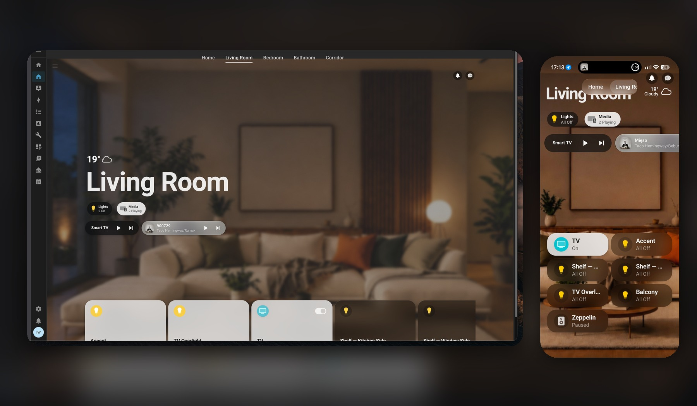
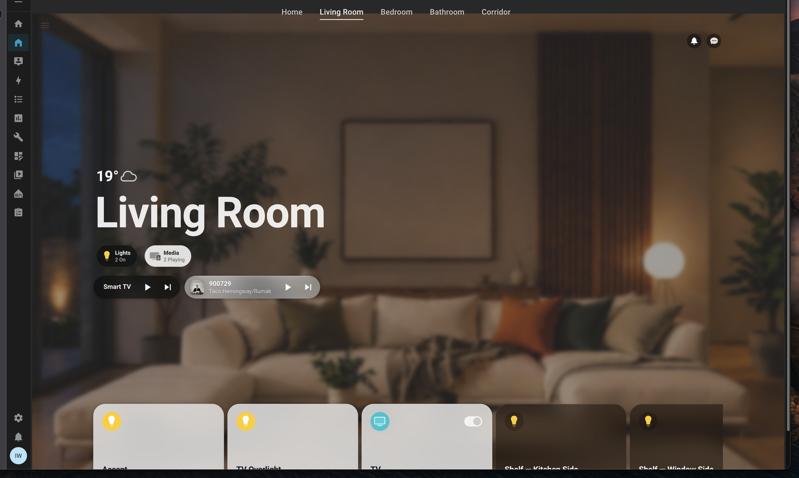
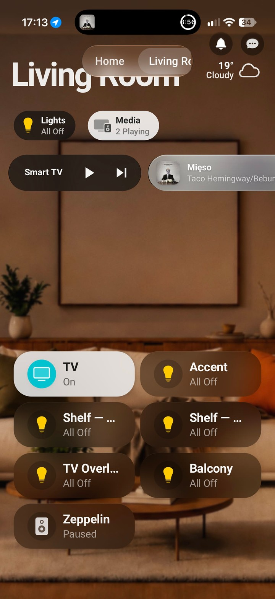

# Home Assistant Hemma Setup

[](https://www.home-assistant.io/)
[](https://github.com/willsanderson/Hemma)
[](LICENSE)

My responsive Home Assistant setup built on [Hemma](https://github.com/willsanderson/Hemma), with an Apple Home-inspired room layout, physical TV controls, Jellyfin Now Playing, custom lighting tiles, energy monitoring, and phone/desktop layouts from one YAML dashboard.



## Highlights

- Five room views with shared text-and-underline navigation
- Responsive desktop, tablet, and phone layouts
- Jellyfin playback metadata, artwork, progress, and transport controls
- Separate physical TV power controls and Android TV app launchers
- Touch-friendly living-room TV remote popup with Apple-like D-pad, Home, back, play/pause, mute, volume controls, and compact Jellyfin/YouTube app shortcuts
- Custom HomeKit TV wrapper with iPhone Remote key forwarding
- Smart light-group toggles that restore the previous member state
- Energy monitoring with a monotonic utility meter
- Wake-up alarm controls and a dedicated stop action
- A **Welcome Home** scene that restores the captured on-lights and keeps all other lighting off
- A centralized **Leave Home** scene for the bedside double-OFF shutdown and Hemma dashboard
- Two-hour Lelit espresso-machine safety shutoff with a restart-restorable timer
- Jellyfin cinema mode with living-room light state restoration
- Bathroom forgotten-on protection for both bathroom lights
- IKEA BILRESA bedside remote with progressive night lighting and whole-home bedtime shutdown
- Bathroom Lamp control with a filament-style bulb icon
- Apple-first typography using the native San Francisco system font where available
- Custom SVG icon set and room artwork

## Screenshots

### Desktop



### Phone

<p align="center">
  
</p>

## Repository layout

```text
config/
├── automations.yaml             # Household automations and physical remote mappings
├── scenes.yaml                  # Welcome Home lighting snapshot
├── custom_components/hemma/   # Hemma integration snapshot with local tweaks
├── dashboards/
│   ├── hemma/hemma.yaml       # Room and entity configuration
│   └── templates/             # Cards, badges, popups and responsive layouts
├── packages/
│   ├── hemma_helpers.yaml     # Helpers, scripts and dashboard automations
│   └── homekit_tv.yaml        # TV wrapper and remote-key forwarding
├── themes/hemma/              # Hemma theme and typography
└── www/hemma/                 # Icons and room images
```

## Automations

[`config/automations.yaml`](config/automations.yaml) is the source-controlled
copy of the active `/config/automations.yaml` file. It currently contains:

- **Bathroom Fan - Delay** — turns off the bathroom fan 20 minutes after it is
  switched on.
- **Wake up with music - Zeppelin** — switches on the Lelit espresso machine,
  then plays *Guten Morgen Sonnenschein* at the configured wake-up time when
  the wake-up helper is enabled.
- **Stop wake-up music** — stops only the Zeppelin from the dashboard stop
  button; the espresso machine remains on.
- **Lelit Espresso Machine - Two-hour safety shutoff** — starts a restorable
  two-hour timer whenever the espresso-machine plug turns on, cancels it when
  the plug turns off, and switches the machine off when the timer expires. If
  Home Assistant restarts while the machine is on without an active restored
  timer, it starts a fresh two-hour safety window.
- **Living Room - Jellyfin cinema mode** — snapshots the Living Room Accent,
  TV Overlight, and both shelf-light circuits when Jellyfin playback starts,
  turns those lights off, and restores their previous states when playback is
  paused, stopped, switched off, or becomes unavailable.
- **Bathroom - Forgotten lights protection** — independently switches off the
  Bathroom LED Strip or Bathroom Lamp after either has remained on for 45
  minutes.
- **Bedroom - BILRESA bedside remote** — maps the IKEA `09B9` ZHA remote:
  - Single ON from 06:00 through 22:59 keeps the daytime behavior: Bed Lamp and
    LED Bed first, then Bedroom Accent.
  - Single ON from 23:00 through 05:59 turns on the Bathroom Lamp and then
    progressively enables LED Bed, Bed Lamp, and Bedroom Accent.
  - Single OFF turns off all three bedroom lights and the Bathroom Lamp.
  - Double ON turns on all three bedroom lights.
  - Double OFF activates `script.leave_home`. The centralized routine applies the
    12-entity Leave Home scene, then conditionally turns off the one TV entity also
    used by Hemma: `media_player.living_room_tv_2`. Across the routine, 13 enabled,
    visible household entities are managed: nine lights, the Lelit espresso
    machine, bathroom fan, Zeppelin, and the living-room TV. Hidden, disabled,
    diagnostic, unavailable, duplicate-TV, and infrastructure entities are
    intentionally excluded.
  - While the configured wake-up alarm is playing, any mapped button press
    stops only the alarm without changing lights, running the bedtime shutdown,
    or switching off the espresso machine.

## Welcome Home scene

[`config/scenes.yaml`](config/scenes.yaml) defines **Welcome Home** as a complete
physical-lighting snapshot. It turns on the five lights that were active when the
scene was captured and explicitly keeps the remaining responsive lighting
entities, including the Bathroom Lamp switch, off. The unavailable Bathroom
Sonoff LED is temporarily excluded from this scene and its active-state sensor,
so it cannot block activation or the Hemma status indication. Derived light
groups and disabled infrastructure entities are excluded to avoid duplicate or
conflicting commands.

The Home view exposes the scene as a **Welcome Home** action tile. It is kept
first in the configured Home rail so Hemma's active-card sorting cannot push the
stateless scene beyond the initially visible controls. A template binary sensor,
`binary_sensor.welcome_home_scene_active`, compares the 10 currently included
physical lighting controls with the scene and drives both the tile highlight and
its **Active** or **Inactive** label. Unknown or unavailable included accessories
do not count as matching; the unavailable Bathroom Sonoff LED is not currently
included.
Activating the tile calls `scene.turn_on` for `scene.welcome_home`.

### Updating the captured lighting state

1. Set every physical light to the state you want after arriving home.
2. Inventory the enabled, non-hidden lighting entities in Home Assistant. Include
   each physical `light.*` entity and any `switch.*` entity that directly controls
   a lamp, such as `switch.bathroom_lamp`. Exclude derived light groups, disabled
   gateways, diagnostics, and infrastructure controls.
3. Update the `entities` map in the live `/config/scenes.yaml` and the matching
   [`config/scenes.yaml`](config/scenes.yaml) file in this repository. Update the
   `binary_sensor.welcome_home_scene_active` template in the live and repository
   copies of `config/packages/hemma_helpers.yaml` with the same entity/state set:
   - Set the desired active lights to `state: "on"`.
   - Preserve supported appearance attributes such as `brightness`,
     `color_temp_kelvin`, or `rgb_color` when the light exposes them and the
     appearance is part of the scene.
   - Keep every remaining physical lighting control in the scene with
     `state: "off"`; do not simply remove lights that should stay dark.
4. Back up the live file, upload the replacement under a temporary filename, and
   move it into place only after the backup exists.
5. Run `ha core check`, then reload **Scenes** from Home Assistant Developer Tools
   or restart Home Assistant. Confirm that `scene.welcome_home` is available.
6. Check that the Hemma Home view still contains exactly one `scene.welcome_home`
   tile. Activate the scene only when changing household lighting is acceptable.
7. Run `git diff --check` and `gitleaks`, update this documentation if the entity
   set changed, then commit and push only the intended files to `main`.

## Leave Home scene

[`config/scenes.yaml`](config/scenes.yaml) defines **Leave Home** from the exact
allowlist previously embedded in the bedside remote's double-OFF branch. Every
included entity is enabled, visible, and non-diagnostic in the live entity
registry. The scene sets nine responsive physical lights, the Lelit
espresso-machine switch, the bathroom fan, and Zeppelin to `off`. The physical
living-room TV is handled separately by `script.leave_home`, using only
`media_player.living_room_tv_2`—the same entity displayed by Hemma. The script
skips the TV command when that entity is already `off`, `unknown`, or
`unavailable`, avoiding the Sony integration error caused by asking an already-off
BRAVIA to turn off again. Other entities representing the same physical TV are
not shutdown targets.

Leave Home does not include the Bathroom Lamp because that entity was not part of
the established bedside shutdown allowlist. The unavailable Bathroom Sonoff LED
is temporarily excluded from both Leave Home and its active-state sensor, so it
cannot block execution or status feedback. Hidden, disabled, diagnostic, and
infrastructure entities remain excluded.

The bedside double-OFF branch and Hemma **Leave Home** tile both call
`script.leave_home`. The script applies `scene.leave_home`, then turns off the
selected Hemma TV only when needed. `binary_sensor.leave_home_scene_active`
compares all 13 target states—including only `media_player.living_room_tv_2` for
the TV—and drives the tile's **Active**/**Inactive** label and active highlight.
Unknown or unavailable targets do not count as matching.

When changing the Leave Home allowlist, update these places together:

1. The non-TV targets in `scene.leave_home` in `config/scenes.yaml`.
2. The conditional TV target in `script.leave_home` in `config/scripts.yaml`.
3. `binary_sensor.leave_home_scene_active` in
   `config/packages/hemma_helpers.yaml`.
4. The Hemma TV card if the selected TV entity changes.
5. The allowlist description in this README.
6. The live files under `/config`, followed by `ha core check` and a Core restart
   or the appropriate scene/script/template/automation reloads.

Before adding any entity, confirm in `core.entity_registry` that `disabled_by`,
`hidden_by`, and `entity_category` are null. Never add broad domains, areas,
groups containing unreviewed members, servers, infrastructure switches, or
maintenance controls. Validate the scene and automation statically; activate the
scene only when a whole-home shutdown is safe.

## Kitchen dashboard

The Kitchen view is included in the shared room navigation on desktop, tablet,
and phone. It contains a dedicated **Lelit Espresso Machine** switch tile using
an espresso-maker silhouette. The tile controls the IKEA GRILLPLATS plug and
reports its current on/off state.

## Potential improvements

The next sensor expansion under consideration is:

- A temperature/humidity sensor in the Bathroom for ventilation control.
- A second temperature/humidity sensor in the Bedroom, where overnight comfort
  measurements are likely to be more actionable than Living Room readings. It
  can also provide a household humidity baseline for the Bathroom.
- One motion sensor in the Bathroom for occupancy-aware lighting.
- One motion sensor in the Corridor for nighttime pathway lighting.

Potential follow-up automations:

- **Humidity-driven bathroom fan** — start the fan when Bathroom humidity rises
  rapidly, exceeds the Bedroom baseline by roughly 8–10 percentage points, or
  passes a high absolute threshold. Stop it after humidity returns close to the
  baseline, while retaining a maximum-runtime fallback.
- **Occupancy-aware bathroom lighting** — turn on the appropriate bathroom light
  when motion is detected and turn it off after 8–10 minutes without motion.
  The existing 45-minute forgotten-on automation should remain as a hard
  fallback because a PIR sensor may not detect someone standing still or behind
  a shower screen.
- **Corridor night pathway** — between approximately 23:00 and sunrise, use
  corridor motion to turn on only a low-impact pathway light, then turn it off
  after 2–3 minutes without motion.
- **Bathroom ventilation warning** — notify when high humidity persists despite
  the fan running or when the bathroom environmental sensor becomes unavailable.
- **Bedroom comfort monitoring** — expose temperature and humidity on the
  dashboard and notify only when uncomfortable conditions persist, avoiding
  noisy alerts for short-lived changes.
- **Motion-aware cinema behavior** — preserve Jellyfin cinema lighting while
  allowing brief corridor and bathroom pathway lighting when someone gets up.
- **Sensor health monitoring** — report low batteries and prolonged unavailable
  states for the environmental sensors, motion sensors, BILRESA remote, and
  other important Zigbee devices.
- **Presence-aware away shutdown** — turn off visible household devices after
  everyone leaves, with a Guest Mode helper to suppress the shutdown when
  someone remains home.

## Configuration change workflow

For every Home Assistant automation or other YAML change:

1. Back up the live file and edit a fresh copy from `/config`.
2. Update the matching file in this repository and document changed behavior
   in this README.
3. Deploy the reviewed YAML and run `ha core check`.
4. Reload the affected domain or restart Home Assistant, then verify the live
   entity or automation.
5. Scan the repository for secrets, commit only the intended files, and push to
   `IgnacyWie/home-assistant-hemma` on `main`.

## Requirements

- Home Assistant **2026.9.0 or newer**
- [HACS](https://hacs.xyz/)
- [UIX](https://github.com/Lint-Free-Technology/uix) — required
- [button-card](https://github.com/custom-cards/button-card) — required
- [apexcharts-card](https://github.com/RomRider/apexcharts-card) — used by chart popups
- [Kiosk Mode](https://github.com/NemesisRE/kiosk-mode) — used by the YAML dashboard
- The Date & Time integration with a time sensor, if you want the room clock

> [!IMPORTANT]
> This is a real configuration snapshot, not a drop-in generic dashboard. Replace every example entity ID in `config/dashboards/hemma/hemma.yaml` and the package files with entities from your own Home Assistant instance before enabling it.

## Installation

### 1. Back up Home Assistant

Create a Home Assistant backup before copying any files.

### 2. Install frontend dependencies

Install UIX, button-card, apexcharts-card, and Kiosk Mode through HACS. Do not install `card-mod` alongside UIX unless you have separately verified that combination.

### 3. Copy the configuration

Copy the contents of this repository's `config/` directory into `/config/` on Home Assistant. Review changes first if those folders already exist.

The vendored `custom_components/hemma/` directory reproduces the dashboard shown here. If you prefer to track upstream Hemma through HACS, install [willsanderson/Hemma](https://github.com/willsanderson/Hemma) instead and port only the dashboard/theme overrides you need.

### 4. Enable packages, themes, and the YAML dashboard

Merge the relevant sections from [`configuration.example.yaml`](configuration.example.yaml) into your own `/config/configuration.yaml`.

### 5. Replace entity IDs

At minimum, review:

- `config/dashboards/hemma/hemma.yaml`
- `config/packages/homekit_tv.yaml`
- the energy entities in `config/packages/hemma_helpers.yaml`
- room images and view names
- Android TV package/activity IDs used by the Jellyfin and YouTube launch buttons

The published dashboard uses `person.example_user` as a privacy-safe placeholder.

### 6. Validate and restart

```bash
ha core check
ha core restart
```

After Home Assistant returns, select the **Hemma** theme from your profile and open the **Home** dashboard.

## TV architecture

The setup intentionally separates two responsibilities:

- `media_player.living_room_tv_2` controls physical television power and app launching.
- `media_player.tv_w_salonie_4` is the Jellyfin session used by Now Playing for reliable title, progress, episode metadata, and transport state.

The HomeKit wrapper exposes a stable TV source list and forwards Apple's standard remote keys to the Android TV remote entity.

## Security and privacy

No `.storage` files, databases, authentication data, tokens, internal URLs, or `secrets.yaml` are included. Personal presence entities were replaced with examples, and the one-time energy-meter calibration from the live system was intentionally removed.

Run your own secret scanner before publishing changes. Never commit Home Assistant backups, databases, `.storage`, `secrets.yaml`, access tokens, webhook IDs, or private certificates.

## Upstream and attribution

This repository is a personalized configuration built on [Hemma](https://github.com/willsanderson/Hemma) by [Will Sanderson](https://github.com/willsanderson), which is licensed under the MIT License. Hemma itself credits [Homio](https://github.com/iamtherufus/Homio) as the original concept and base implementation.

Local configuration and dashboard customizations are maintained by Ignacy Wielogórski. See [NOTICE.md](NOTICE.md) and [LICENSE](LICENSE).
